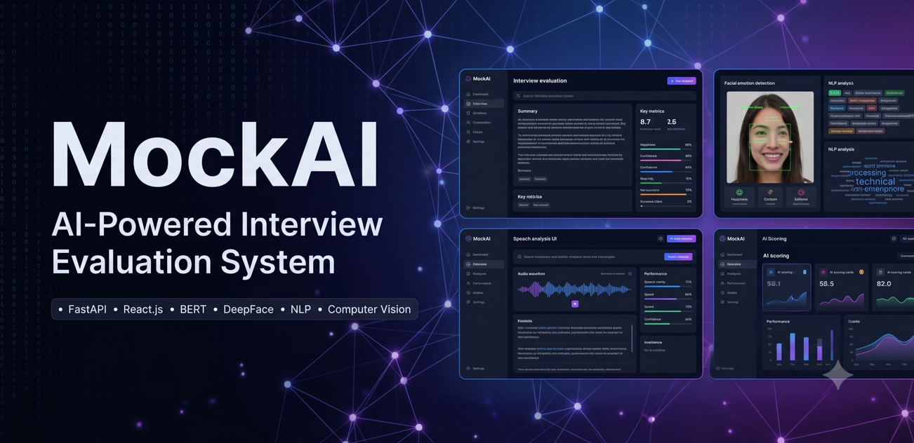

# MockAI – AI-Powered Interview Evaluation System

<p align="center">
  
</p>

Research-oriented AI interview evaluation platform focused on multimodal analysis using speech recognition, NLP, and facial emotion detection to assess communication, confidence, and interview performance.

## Overview

MockAI is a Final Year Project designed to simulate and evaluate interview performance using artificial intelligence and machine learning workflows.

The system combines speech-to-text processing, NLP-based answer evaluation, and facial emotion analysis to generate intelligent interview feedback and performance insights.

The project focuses on modular AI architecture, multimodal processing pipelines, and scalable evaluation workflows.

## Current Status

MockAI is currently under active development as a research-oriented AI system focused on intelligent interview evaluation workflows and multimodal analysis.

## Features

### AI Interview Evaluation

* AI-assisted mock interview workflows
* Automated performance evaluation
* Intelligent scoring and feedback generation
* Communication and confidence assessment

### NLP & Speech Processing

* Speech-to-text conversion
* NLP-based answer analysis
* Semantic evaluation workflows
* Context-aware response assessment

### Facial Emotion Detection

* Facial expression analysis
* Emotion recognition workflows
* Confidence and stress-level estimation
* Real-time facial analysis pipeline

### Reporting & Analytics

* Interview performance reports
* Evaluation score generation
* Feedback visualization workflows
* Analytical performance insights

## Current Modules

* Speech-to-Text Processing
* NLP-Based Answer Evaluation
* Facial Emotion Detection
* Interview Scoring Engine
* Feedback Report Generation

## Research Focus

* Multimodal AI systems
* NLP-driven evaluation workflows
* Emotion recognition systems
* AI-assisted interview analysis
* Human-computer interaction workflows

## Engineering Highlights

* Modular AI system architecture
* Multimodal processing pipeline
* NLP and computer vision integration
* Structured backend workflows
* Maintainable project organization
* AI-driven evaluation engine design

## Screenshots

<p align="center">
  
  
</p>

<p align="center">
  
  
</p>


## Tech Stack

### Frontend

* React.js
* Tailwind CSS

### Backend

* FastAPI
* Python

### AI & Machine Learning

* BERT
* DeepFace
* OpenCV
* SpeechRecognition

### Database & Tools

* MongoDB
* Git & GitHub
* Postman

## Architecture

```text id="e7a2vq"
User Interview Input
        ↓
Speech-to-Text Processing
        ↓
NLP Analysis (BERT)
        ↓
Facial Emotion Detection (DeepFace)
        ↓
Scoring & Evaluation Engine
        ↓
Feedback Report Generation
```

## Installation

### Clone Repository

```bash id="w4j9pk"
git clone https://github.com/syedasjadabbas/MockAI.git
```

### Backend Setup

```bash id="f3v8mz"
cd backend
pip install -r requirements.txt
uvicorn main:app --reload
```

### Frontend Setup

```bash id="r1m7xq"
cd frontend
npm install
npm run dev
```

## Project Structure

```text id="m2k9sv"
MockAI/
├── frontend/                 # React frontend
├── backend/                  # FastAPI backend
├── ai-models/                # AI/ML modules
├── datasets/                 # Training/testing data
├── assets/                   # Banner and assets
└── README.md
```

## Future Improvements

* Real-time interview analytics
* Advanced scoring algorithms
* Cloud deployment workflows
* AI recommendation engine
* Expanded multimodal evaluation pipeline

## Author

SYED ASJAD ABBAS
